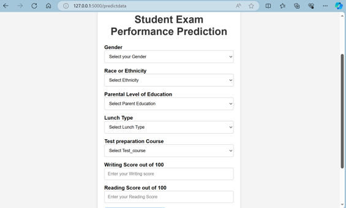
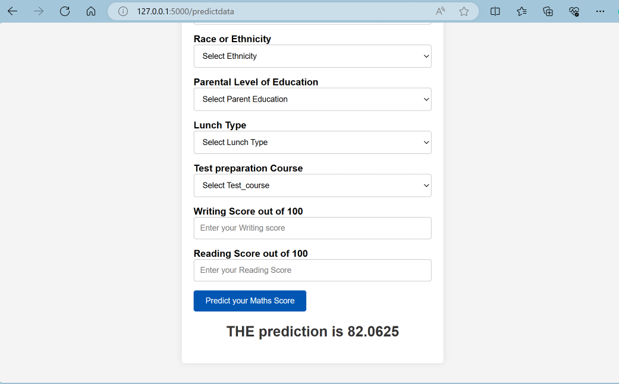

## End To End Machine Learning Project

- this is an End-to-End Machine learning project, I aim to learn how to implement and use the trained model in a website. this project predicts the Math score based on some criteria, we create the prediction pipeline using the Flask web app.

- you can find the YouTube tutorial that guides me: [HERE](https://www.youtube.com/playlist?list=PLZoTAELRMXVPS-dOaVbAux22vzqdgoGhG)
 

- here are some pic from the website: 

